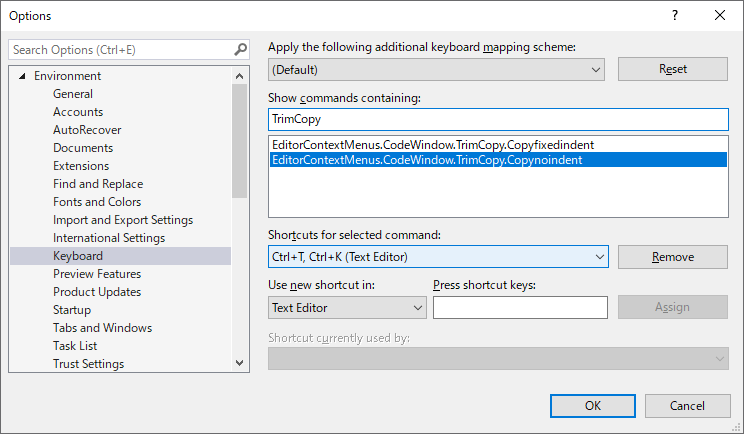

# Trim Copy

Trim Copy is a Visual Studio extension to copy selected code block to the clipboard trimming leading white spaces while keeping indentation structure. It allows you to copy the code in text editor of Visual Studio, trim unnecessary white spaces and paste it into a document in Markdown or other format by one step.

## Requirements

 * Visual Studio 2015, 2017, 2019
 * .NET Framework 4.8

If you have only installed older version of .NET Framework, use [VSIX package](https://github.com/emoacht/TrimCopy/releases/download/2.1/TrimCopy.vsix) which is built for .NET Framewrok 4.6.

## Keyboard shortcuts

The keyboard shortcuts can be assigned by Visual Studio's options settings. See [Identify and customize keyboard shortcuts in Visual Studio](https://docs.microsoft.com/ja-jp/visualstudio/ide/identifying-and-customizing-keyboard-shortcuts-in-visual-studio).

Open `Options`, go to `Keyboard` and find this extension's commands by searching __TrimCopy__ in `Show commands containing` box.

Set shortcut keys as you wish.

## Development

To run an extension in debug mode inside [experimental instance](https://docs.microsoft.com/en-us/visualstudio/extensibility/the-experimental-instance) of Visual Studio, the following settings are required in __Debug__ pane of project properties.

 - In __Start Action__, select __Start external program__ and input the path to Visual Studio executable. The typical path would be `C:\Program Files (x86)\Microsoft Visual Studio\2019\Community\Common7\IDE\devenv.exe`.
 - In __Start Options__, fill __Command line arguments__ with `/rootsuffix Exp`.

These are default for Extensibility VSIX project and written in csproj.user file but that file is not included in the repository in principle.

## History

Ver 2.1 2019-12-15

 - Modified settings in Options

Ver 2.0 2017-2-19

 - Converted to be compatible with Visual Studio 2017

Ver 1.2 2016-5-28

 - Fixed default values in the settings

Ver 1.1 2016-4-24

 - Modified vsix manifest for Visual Studio "15"

Ver 1.0 2016-1-6

 - Initial release

## License

 - MIT License